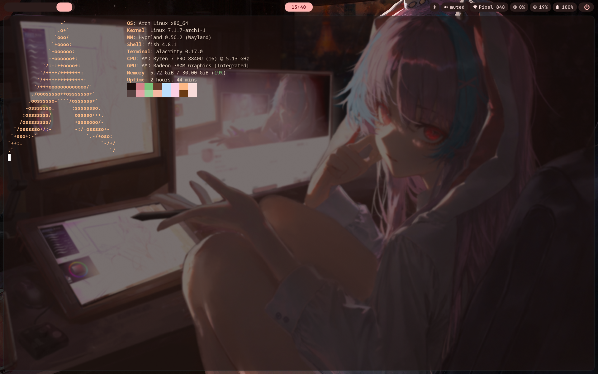
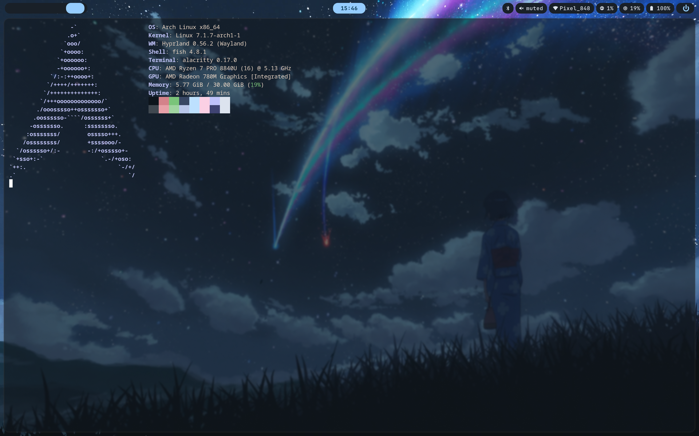

# wallsync

Wallpaper-driven dynamic theming for Hyprland: pick a wallpaper, and the whole desktop's
color scheme updates to match — Waybar, Hyprland borders, Rofi, wlogout, and Alacritty.

Part of my broader setup — see [arch-hyprland-rice](https://github.com/Lro-rgb/arch-hyprland-rice)
for the rest (Hyprland config, terminal, shell, file manager).

## In action

Same terminal and bar, two different wallpapers — everything down to the window
border color comes from whatever image is currently set as the wallpaper.

| Before | After |
|--------|-------|
|  |  |

## How it works

```
waypaper (picker)  →  matugen (extract palette)  →  templates render into:
                                                        waybar/colors.css
                                                        hypr/colors.conf
                                                        rofi/*.rasi
                                                        wlogout/colors.css
                                                        alacritty/colors.toml
                                                     →  waybar reloaded (SIGUSR2)
                                                     →  hyprctl reload
```

1. **[waypaper](https://github.com/anufrievroman/waypaper)** is the GUI wallpaper
   picker (backed by `swww`). Its own custom rofi grid, built by
   `matugen/wallpaper.sh`, generates thumbnails and lets me pick a wallpaper via rofi
   instead.
2. Whichever way the wallpaper is chosen, **[matugen](https://github.com/InioX/matugen)**
   runs against it (`matugen image <path> --type scheme-vibrant`) and extracts a
   Material You color palette from the image.
3. matugen renders that palette through the templates in `matugen/templates/` and
   writes the results straight into the config directories of Waybar, Hyprland, Rofi,
   wlogout, and Alacritty (see `matugen/config.toml` for the input → output mapping).
4. `matugen/refresh.sh` ties it together: runs matugen, then `hyprctl reload` and
   `pkill -SIGUSR2 waybar` so everything picks up the new colors live, no restart
   needed.

## Layout

```
waypaper/            Wallpaper picker config + the script that applies a theme to
                      whatever waypaper currently has selected
matugen/              Palette generation config, templates, and the refresh/wallpaper
                      picker scripts
matugen/templates/    Input templates matugen renders (waybar, hyprland, rofi,
                      wlogout, alacritty)
waybar/                Bar config + a snapshot of what a generated colors.css looks
                      like (colors.generated-example.css — this file gets overwritten
                      by matugen at runtime, it's here just to show the output shape)
hypr/                 The script that ties waypaper + matugen together on wallpaper
                      change, plus a generated-colors example (same idea as above)
```

Files named `*.generated-example.*` are checked in only as a reference for what
matugen produces — in a live setup they're overwritten every time the wallpaper
changes and wouldn't normally be committed.

## Triggering a theme change

- `$mainMod + W` in Hyprland runs `matugen/wallpaper.sh` — opens the custom rofi
  wallpaper grid, and applies the new palette on selection.
- `hypr/wallpaper.sh` does the same against whatever waypaper currently has set,
  useful for re-applying on login (`waypaper --restore`).
